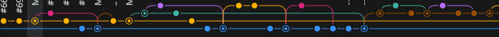
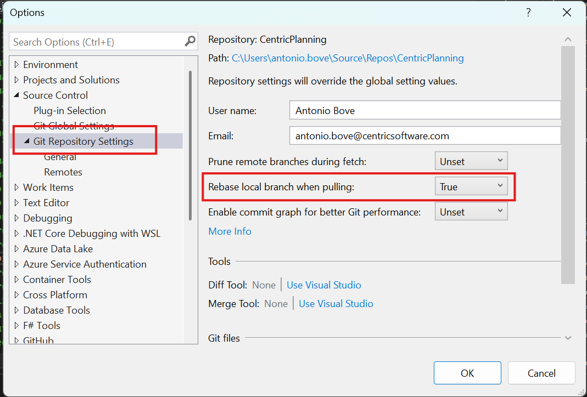

---
# You can also start simply with 'default'
theme: seriph
# random image from a curated Unsplash collection by Anthony
# like them? see https://unsplash.com/collections/94734566/slidev
# background: ./shaken-not-stirred.jpg
layout: image-right
image: ./assets/shaken-not-stirred.jpg
# some information about your slides (markdown enabled)
title: Welcome to Slidev
info: |
  ## Slidev Starter Template
  Presentation slides for developers.

  Learn more at [Sli.dev](https://sli.dev)
# apply unocss classes to the current slide
class: text-center
# https://sli.dev/features/drawing
drawings:
  persist: false
# slide transition: https://sli.dev/guide/animations.html#slide-transitions
transition: slide-left
# enable MDC Syntax: https://sli.dev/features/mdc
mdc: true
---

# Rebased, not merged

  

### come e perché mantenere una *git history* il più lineare possibile

<!-- Setting `pull.rebase = true` in the Git config is a great way to avoid unnecessary merge commits and keep the Git history cleaner. However, it's important to educate your team about some **changes in behavior** they might encounter after enabling this setting, especially since they're used to their IDE handling Git operations for them. Here's what they might notice: -->

---
layout: center
# layout: image
# image: assets/rebasing-vs-merging-diagram.png
# backgroundSize: contain
---

# `git pull` == `git fetch` + `git merge`

---
layout: image-right
image: assets/rebasing-vs-merging-diagram.png
backgroundSize: contain
---

   
## Merge strategy

 

La strategia di default di Git, quando si `git pull`, è la merge: in caso di divergenza tra la remote e il nostro locale crea un **merge commit** (che ci siano conflitti o meno).

---
layout: image-left
image: assets/rebasing-vs-merging-diagram.png
backgroundSize: contain
---

   
## `git pull --rebase`

 

C'è una strategia alternativa: **rebase**. Con questo comando git, invece di effettuare una merge, *stacca* i nostri commit locali, per *riapplicarli* poi dopo le nuove changes introdotte con la pull

---
layout: center
---

# Un grosso vantaggio

### Storia lineare
Non ci sono più i *merge commit*, e non verranno mantenuti nella *git history* i nostri branch **locali temporanei**...

---
layout: center
---

# Vantaggi di una storia lineare
- Maggiore facilità di visualizzazione
- Possibilità di facile *rollback* (`git revert <commit #>`)

---

# Svantaggi
- ### Alcuni cambi nel workflow legato al `git pull`
In particolare sarà sempre necessario fare lo *stash* delle modifiche presenti non committate prima di poter pullare

<!-- 
boom baby
 -->

- ### Piccola possibilità di *maggiore* difficoltà nella gestione di *merge conflicts*
    - gestire conflitti
    - `git rebase --continue`

    

        `git rebase --abort` -> `git pull --no-rebase`
    

    

        <code>git rebase --abort</code> -> `git pull --no-rebase`
    

---

# Configurazione

## Linea di comando
`git config pull.rebase true`

## Visual Studio
Tools > Options

---
layout: image
image: ./assets/vs-options.png
---

---

